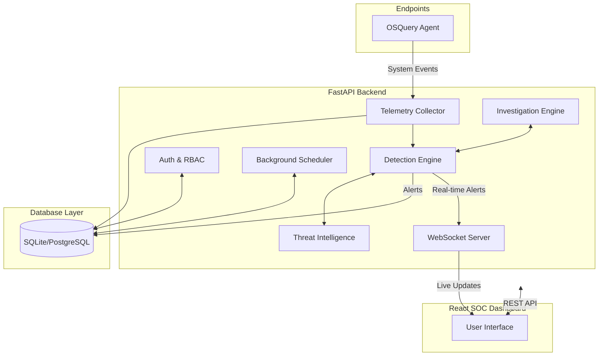

# 🏛️ Architecture

SentinelX EDR leverages an event-driven microservices architecture to process and analyze endpoint telemetry in real-time. The platform utilizes **OSQuery** for continuous endpoint monitoring and forwards telemetry to a high-performance **FastAPI** backend.

---

## 🏗️ System Architecture



---

## 🛠️ Technology Stack

| Component | Technology | Purpose |
| --- | --- | --- |
| **Backend Framework** | FastAPI (Python) | High-performance, async API server for managing endpoints and alerts. |
| **Frontend Framework** | React + Vite | Fast, modern Single Page Application (SPA) for the SOC dashboard. |
| **Styling** | Tailwind CSS | Utility-first CSS framework for rapid, responsive UI development. |
| **Database ORM** | SQLAlchemy | Python SQL toolkit and Object Relational Mapper. |
| **Database Engine**| SQLite / PostgreSQL | Persistent data storage (currently SQLite for development). |
| **Migrations** | Alembic | Database migration tool for SQLAlchemy. |
| **Real-time Comms** | WebSockets | Live streaming of alerts, agent status, and system health to the UI. |
| **Endpoint Agent** | OSQuery | Cross-platform endpoint telemetry collection. |
| **AI/LLM Logic** | LangChain / OpenRouter / Gemini | Automated incident investigation and alert context generation. |
| **Containerization**| Docker | Consistent deployment environments. |

---

## 📁 Project Structure

```text
SentinelX-EDR/
├── backend/
│   ├── app/
│   │   ├── api/          # FastAPI Routes (Auth, Alerts, Telemetry, etc.)
│   │   ├── core/         # Config, Security, JWT, RBAC
│   │   ├── models/       # SQLAlchemy ORM Models
│   │   ├── schemas/      # Pydantic Validation Schemas
│   │   ├── services/     # Business Logic (Detection, Agent, AI)
│   │   ├── db/           # Database connections
│   │   └── main.py       # FastAPI Entry Point
│   ├── alembic/          # Database Migrations
│   ├── requirements.txt
│   └── .env
├── frontend/
│   ├── src/
│   │   ├── components/   # Reusable UI Components
│   │   ├── contexts/     # React Contexts (Auth, Theme)
│   │   ├── pages/        # Main Dashboard Views
│   │   ├── services/     # Axios API Clients
│   │   ├── utils/        # Helpers (Permissions, Formatting)
│   │   ├── App.jsx       # Main Router
│   │   └── main.jsx
│   ├── package.json
│   ├── tailwind.config.js
│   └── vite.config.js
├── agent/                # OSQuery Agent Configs
├── docker-compose.yml
├── README.md             # Main Project Entry
├── ARCHITECTURE.md       # (This file)
├── API.md                # API Specifications
├── SECURITY.md           # Security Model
├── DEPLOYMENT.md         # Deployment Guides
└── CONTRIBUTING.md       # Contributing Guidelines
```
