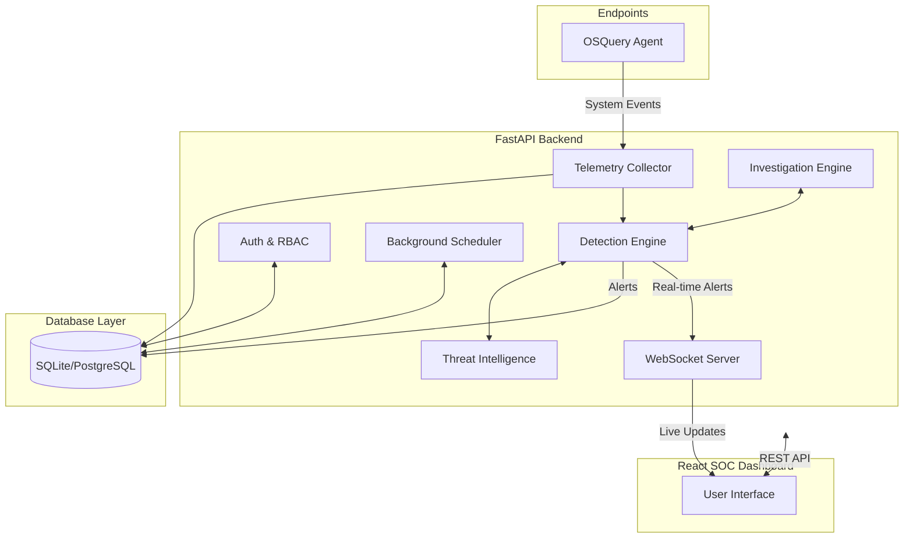

# 🛡️ SentinelX EDR

<div align="center">
  <h3>Enterprise AI-Powered Endpoint Detection & Response Platform</h3>
  <p>Real-Time Telemetry • Threat Hunting • AI Investigation • Detection Engineering</p>
</div>

<p align="center">
  
  
  
  
  
  
  
</p>

---

## 📖 Overview & "Why SentinelX?"

**SentinelX EDR** is a professional, AI-powered Endpoint Detection and Response (EDR) platform designed for modern Security Operations Centers (SOCs). Modern threats move faster than traditional SIEMs can process. We built SentinelX to solve the gap between **raw telemetry** and **actionable security intelligence**. 

- **Why OSQuery?** It provides unparalleled visibility into endpoints by exposing the operating system as a high-performance relational database.
- **Why Real-Time?** By utilizing WebSockets and event-driven architecture, SOC analysts see alerts the second a process executes or a socket opens, minimizing the dwell time of adversaries.
- **Why AI?** Security engineers are overloaded with alert fatigue. SentinelX leverages LLMs to automatically investigate anomalous behavior, generating human-readable context before the analyst even opens the alert.

---

## ✨ Enterprise Features Matrix

| Feature | Status | Description |
|---|:---:|---|
| **Live Telemetry** | ✅ | Continuous OSQuery ingestion & processing |
| **Detection Engine** | ✅ | Rule-based (Sigma) & heuristic evaluation |
| **WebSockets** | ✅ | Instant push alerts and agent status updates |
| **RBAC** | ✅ | Granular Role-Based Access Control |
| **Audit Logs** | ✅ | Immutable historical tracking of SOC actions |
| **Threat Hunting** | ✅ | Manual SQL queries against endpoints |
| **AI Investigation** | ✅ | Automated contextual analysis via LLMs |
| **Multi-Endpoint** | 🚧 | Fleet grouping and mass policy deployment |
| **Threat Intel** | 🚧 | Automated external IOC feed integration |
| **Correlation Engine** | 🚧 | Multi-host, time-series anomaly detection |
| **Evidence Locker** | 🚧 | Secure hashing and artifact storage |
| **Reporting** | 🚧 | Automated PDF compliance generation |

---

## 🎯 MITRE ATT&CK Coverage

SentinelX aligns its detection engineering directly with the MITRE ATT&CK framework:

- [x] **Execution**: Catching malicious parent-child process chains.
- [x] **Persistence**: Monitoring autorun keys, scheduled tasks, and services.
- [x] **Discovery**: Detecting excessive `net` or `whoami` enumeration.
- [x] **Credential Access**: Identifying LSASS dumping or registry SAM extraction.
- [x] **Command & Control**: Flagging suspicious outbound beacons to known bad IPs.
- [x] **Defense Evasion**: Spotting log clearing and security tool tampering.

---

## 🏗️ System Architecture

SentinelX EDR leverages an event-driven microservices architecture to process and analyze endpoint telemetry in real-time. 



### 🛠️ Technology Stack

| Component | Technology | Purpose |
| --- | --- | --- |
| **Backend Framework** | FastAPI (Python) | High-performance, async API server for managing endpoints and alerts. |
| **Frontend Framework** | React + Vite | Fast, modern Single Page Application (SPA) for the SOC dashboard. |
| **Styling** | Tailwind CSS | Utility-first CSS framework for rapid, responsive UI development. |
| **Database ORM** | SQLAlchemy | Python SQL toolkit and Object Relational Mapper. |
| **Database Engine**| SQLite / PostgreSQL | Persistent data storage (currently SQLite for development). |
| **Migrations** | Alembic | Database migration tool for SQLAlchemy. |
| **Real-time Comms** | WebSockets | Live streaming of alerts, agent status, and system health to the UI. |
| **Endpoint Agent** | OSQuery | Cross-platform endpoint telemetry collection. |
| **AI/LLM Logic** | LangChain / OpenRouter / Gemini | Automated incident investigation and alert context generation. |
| **Containerization**| Docker | Consistent deployment environments. |

### 📁 Project Structure

```text
SentinelX-EDR/
├── backend/
│   ├── app/
│   │   ├── api/          # FastAPI Routes (Auth, Alerts, Telemetry, etc.)
│   │   ├── core/         # Config, Security, JWT, RBAC
│   │   ├── models/       # SQLAlchemy ORM Models
│   │   ├── schemas/      # Pydantic Validation Schemas
│   │   ├── services/     # Business Logic (Detection, Agent, AI)
│   │   ├── db/           # Database connections
│   │   └── main.py       # FastAPI Entry Point
│   ├── alembic/          # Database Migrations
│   ├── requirements.txt
│   └── .env
├── frontend/
│   ├── src/
│   │   ├── components/   # Reusable UI Components
│   │   ├── contexts/     # React Contexts (Auth, Theme)
│   │   ├── pages/        # Main Dashboard Views
│   │   ├── services/     # Axios API Clients
│   │   ├── utils/        # Helpers (Permissions, Formatting)
│   │   ├── App.jsx       # Main Router
│   │   └── main.jsx
│   ├── package.json
│   ├── tailwind.config.js
│   └── vite.config.js
├── agent/                # OSQuery Agent Configs
├── docker-compose.yml
└── README.md             # Main Project Entry
```

---

## 🔒 Security Model & RBAC

SentinelX EDR is built with a security-first mindset, ensuring that the platform managing your endpoints is itself resilient against attacks.

### Role-Based Access Control (RBAC)
SentinelX employs strict RBAC at both the **Backend API** layer and the **Frontend UI** layer.
- **Admin**: Full system access, agent deployment, user management.
- **SOC Manager**: Manage detection rules, investigate alerts, isolate endpoints.
- **Analyst**: View dashboards, hunt threats, read alerts (read-only access to critical functions).

**Enforcement:**
- **Backend**: API routes use `Depends(RequirePermission("action:isolate"))` to cryptographically enforce authorization via the user's validated JWT token.
- **Frontend**: Buttons and sensitive views are wrapped in a `<HasPermission>` React component to prevent unauthorized rendering.

### Authentication Lifecycle
SentinelX uses a robust **JSON Web Token (JWT)** architecture:
- **Short-lived Access Tokens**: (e.g., 15-30 minutes) Used for all API requests.
- **Long-lived Refresh Tokens**: (e.g., 7 days) Used to obtain new access tokens silently.
- **Proactive Expiration**: The frontend explicitly monitors token expiry, prompting the user 60 seconds before session termination.
- **Backend Revocation**: Logging out invalidates the session explicitly rather than just clearing client-side storage.
- **Lockouts**: After too many failed attempts, accounts are locked (HTTP 403/423) to prevent brute-force attacks.

### Audit Logging
Every significant action within the platform is recorded immutably in the Audit Log, tracking Timestamp, User, Action, Target Object, Status (Success/Failed/Denied), IP Address, and Request ID.

---

## 🔌 API Reference

SentinelX EDR provides a comprehensive RESTful API via FastAPI, alongside real-time WebSocket endpoints for instantaneous SOC updates.

### Base URL
`http://<server-ip>:8000/api/v1`

### Core Endpoints
- **Auth & Users**: `POST /auth/token`, `POST /auth/logout`, `GET /auth/me`
- **Telemetry & OSQuery**: `POST /osquery/enroll`, `POST /osquery/log`, `POST /osquery/config`
- **Endpoints**: `GET /endpoints`, `POST /endpoints/{id}/isolate`
- **Alerts**: `GET /alerts`, `POST /alerts/{id}/investigate`
- **System**: `GET /health`, `GET /audit`

### WebSocket Endpoints
Real-time communications are pushed over WebSockets (`ws://<server-ip>:8000/api/v1/ws/notifications`). Payload types include `new_alert`, `agent_status`, and `system`.

---

## ✅ Validation Suite

SentinelX EDR includes a comprehensive validation suite designed to verify that all internal subsystems are functioning perfectly. This ensures a stable, enterprise-ready environment and acts as an integration testing benchmark.

**Subsystems Validated (15/15 Pass Rate):**
- Authentication & JWT Authorization
- System Health & API Latency
- Database Connectivity & Schema
- Endpoint Registration & Telemetry Ingestion
- OSQuery Payload Parsing
- Threat Detection Engine & Sigma Rules
- WebSocket Notifications
- Audit Logging & Background Schedulers
- AI Investigation endpoints

To run the validation suite:
```bash
cd validation_suite
python run_all.py
```
*Generates HTML and JSON reports in `validation_suite/reports/`.*

---

## 🚀 Installation & Deployment

This guide covers deploying SentinelX EDR for development, testing, and production environments.

### 🐳 Docker Deployment (Recommended)
The easiest way to run the entire stack (Frontend, Backend, Database) is via Docker Compose.
```bash
git clone https://github.com/monish0001000/SentinelX-EDR.git
cd SentinelX-EDR
cp backend/.env.example backend/.env
# Edit backend/.env with your secure SECRET_KEY
docker-compose up --build -d
```
Access the application:
- **Frontend Dashboard**: `http://localhost:5173`
- **Backend API Docs**: `http://localhost:8000/docs`

### 💻 Local Development
**Backend Setup**
```bash
cd backend
python -m venv venv
source venv/bin/activate  # On Windows: venv\Scripts\activate
pip install -r requirements.txt
alembic upgrade head
uvicorn app.main:app --reload --host 0.0.0.0 --port 8000
```
**Frontend Setup**
```bash
cd frontend
npm install
npm run dev
```

### ⚙️ Configuration (.env)
SentinelX utilizes an environment variable file (`.env`) in the `backend` directory.
```ini
ENVIRONMENT=development
DATABASE_URL=sqlite:///./sentinelx.db
SECRET_KEY=your-super-secret-jwt-key
ACCESS_TOKEN_EXPIRE_MINUTES=30
REFRESH_TOKEN_EXPIRE_DAYS=7

# External API Keys (Optional - System degrades gracefully if omitted)
OPENROUTER_API_KEY=your-openrouter-key
GEMINI_API_KEY=your-gemini-key
THREAT_INTEL_API_KEY=your-ti-key
```

---

## 📸 Screenshots

> **Note:** Screenshots are currently placeholders while we gather final captures of the Phase 13 UI. Place actual images in `docs/images/`.

- **Live Incident Response (Demo)**: `docs/images/demo.gif`
- **Dashboard Overview**: `docs/images/dashboard.png`
- **Interactive Threat Hunting**: `docs/images/threat-hunting.png`
- **AI Investigations**: `docs/images/investigations.png`
- **Audit Logs**: `docs/images/audit.png`
- **Health Dashboard**: `docs/images/health.png`

---

## 🛣️ Roadmap & Milestones

- [x] **Phase 11.0**: Telemetry & WebSockets
- [x] **Phase 12.0**: AI Investigations (LLM Integration, Context Generation)
- [x] **Phase 13.1**: Authentication UI & RBAC Overhaul (Audit logs, Health Metrics, Session Security)
- [ ] **Phase 13.2**: Backend Authentication Hardening (API dependency injection logic)
- [ ] **Phase 13.3**: Evidence Locker & Forensic Artifact Collection
- [ ] **Phase 13.4**: Threat Intelligence Feed Integration (OTX, MISP)
- [ ] **Phase 13.5**: Advanced Multi-Endpoint Management & Policy Groups
- [ ] **Phase 14.0**: Production Release (PostgreSQL migration, Docker optimization, final security audits)

---

## 🤝 Contributing to SentinelX

We welcome contributions from the community! 
1. Fork the Repository.
2. Clone Locally and Create a Feature Branch (`git checkout -b feature/AddAwesomeDetectionRule`).
3. Make Your Changes (Ensure Python matches PEP 8 via `flake8`/`black`).
4. Commit and Push to your fork.
5. Submit a Pull Request.

If you find a bug, please open an issue with a clear description, steps to reproduce, and expected behavior.

---

## 👨‍💻 Author

**Monish**  
*Cybersecurity Student & Aspiring Security Engineer*  
GitHub: [https://github.com/monish0001000](https://github.com/monish0001000)

[](https://opensource.org/licenses/MIT)
